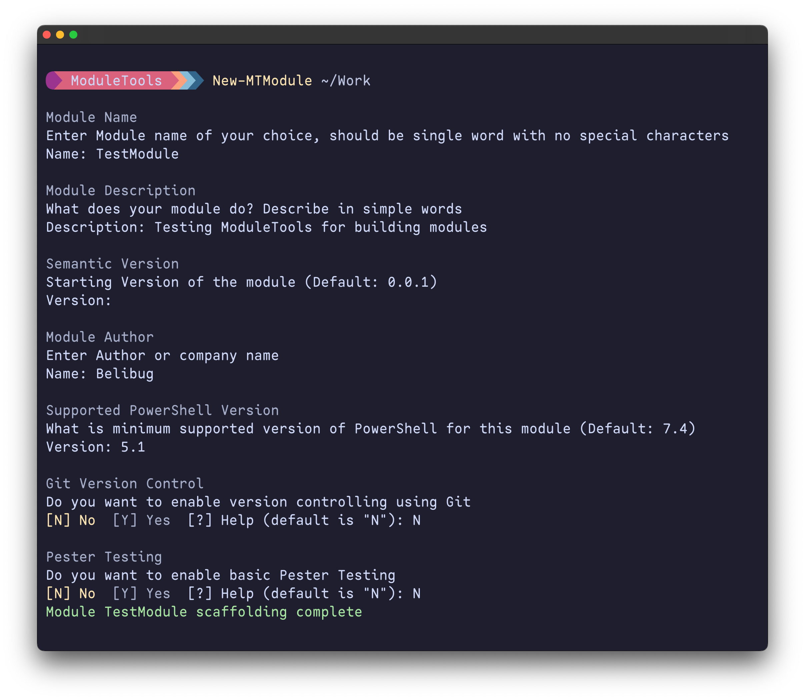

# ModuleTools

ModuleTools is a versatile, standalone PowerShell module builder. Create anything from simple to robust modules with ease. Built for CICD and Automation.

[![ModuleTools@PowerShell Gallery][BadgeIOCount]][PSGalleryLink]
![WorkFlow Status][WorkFlowStatus]

The structure of the ModuleTools module is meticulously designed according to PowerShell best practices for module development. While some design decisions may seem unconventional, they are made to ensure that ModuleTools and the process of building modules remain straightforward and easy to manage.

> [!IMPORTANT]
> Checkout this [Blog article](https://blog.belibug.com/post/ps-modulebuild) explaining core concepts of ModuleTools.

## Design

To ensure this module works correctly, you need to maintain the folder structure and the `project.json` file path. The best way to get started is by running the `New-MTModule` command, which guides you through a series of questions and creates the necessary scaffolding.

## Folder Structure

All the Module files should be in inside `src` folder

```
 .
├──  project.json
├──  private
│  └──  New-PrivateFunction.ps1
├──  public
│  └──  New-PublicFunction.ps1
├──  resources
│  └──  some-config.json
└──  tests
   └──  Pester.Some.Tests.ps1
```

### Dist Folder

Generated module is stored in dist folder, you can easily import it or publish it to PowerShell repository. 

```
 dist
└──  TestModule
   ├──  TestModule.psd1
   └──  TestModule.psm1
```


### Project JSON File

The `project.json` file contains all the important details about your module and is used during the module build. It should comply with a specific schema. You can refer to the sample `project-sample.json` file in the `example` directory for guidance.

Run `New-MTModule` to generate the scaffolding; this will also create the `project.json` file.

### Src Folder

  - Place all your functions in the `private` and `public` folders within the `src` directory.
  - All functions in the `public` folder are exported during the module build.
  - All functions in the `private` folder are accessible internally within the module but are not exposed outside the module.

### Tests Folder

If you want to run `pester` tests keep them in `tests` folder, if not you can ignore this function.

## Commands

### New-MTModule

This interactive command helps you create the module structure. Easily create the skeleton of your module and get started with module building in no time.

```powershell
## Create a module skeleton in Work Directory
New-MTModule ~/Work
```



### Invoke-MTBuild

`ModuleTools` is designed so that you don't need any additional tools like `make` or `psake` to run the build commands. There's no need to maintain complex `build.ps1` files or sample `.psd1` files. Simply follow the structure outlined above, and you can run `Invoke-MTBuild` to build the module. The output will be saved in the `dist` folder, ready for distribution.

```powershell
# From the Module root 
Invoke-MTBuild

## Verbose for more details
Invoke-MTBuild -Verbose
```

### Get-MTProjectInfo

This functions give you complete info about the project which can be used in pester tests or for general troubleshooting.

### Invoke-MTTest

All the pester configurations are stored in `project.json`, simply run `Invoke-MTTest` command from project root, it will run all the tests inside `tests` folder

- To skip a test insdie test directory use `-skip` in describe/it/context block within Pester test.
- Use `Get-MTProjectInfo` command inside pester to get great amount of info about project and files

### Update-MTModuleVersion

A simple command to update the module version by modifying the values in `project.json`. You can also manually edit the file in your favorite editor. This command makes it easy to update the semantic version.

- Running `Update-MTModuleVersion` without any parameters will update the patch version (e.g., 1.0.1 -> 1.0.2).
- Running `Update-MTModuleVersion -Label Major` updates the major version (e.g., 1.0.1 -> 2.0.1).
- Running `Update-MTModuleVersion -Label Minor` updates the minor version (e.g., 1.0.1 -> 1.1.1).

## Advanced - Use it in Github Actions

This is not required for local module builds, if you are running github actions, use below template to test, build and publish module with ease.

```yaml
name: Build, Test and Publish

on:
  push:
    branches:
      - main

jobs:
  build:
    runs-on: ubuntu-latest
    steps:
      - uses: actions/checkout@v4

      - name: Install ModuleTools module form PSGallery
        run: |
          Install-PSResource -Repository PSGallery -Name ModuleTools -TrustRepository
        shell: pwsh

      - name: Build Module
        run: Invoke-MTBuild -Verbose
        shell: pwsh

      - name: Run Pester Tests
        run: Invoke-MTTest
        shell: pwsh
      - name: Publish Package to Github
        run: |
          Publish-PSResource -Path ./dist/YourModule -Repository SomeRepository -ApiKey $Env:ApiKey
        env:
          ApiKey: ${{ secrets.API_KEY }}
        shell: pwsh
```

## Requirement

- Only tested on PowerShell 7.4, most likely wont work on 5.1
- No depenedencies. This module doesn’t depend on any other module.

## ToDo

- [ ] Support Classes and Enums in modules

## Contributing

Contributions are welcome! Please fork the repository and submit a pull request with your changes. Ensure that your code adheres to the existing style and includes appropriate tests.

## License

This project is licensed under the MIT License. See the LICENSE file for details.

[BadgeIOCount]: https://img.shields.io/powershellgallery/dt/ModuleTools?label=ModuleTools%40PowerShell%20Gallery
[PSGalleryLink]: https://www.powershellgallery.com/packages/ModuleTools/
[WorkFlowStatus]: https://img.shields.io/github/actions/workflow/status/belibug/ModuleTools/Tests.yml